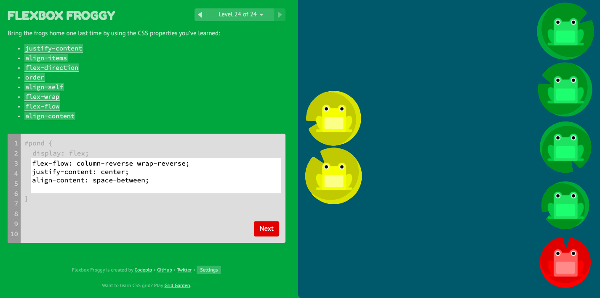

# FlexBox Froggy

https://flexboxfroggy.com/

## Level 1

```css
#pond {
  display: flex;
  justify-content: flex-end;
}
```


## Level 2

```css
#pond {
  display: flex;
  justify-content: center;
}
```


## Level 3

```css
#pond {
  display: flex;
  justify-content: space-around;
}
```


## Level 4

```css
#pond {
  display: flex;
  justify-content: space-between;
}
```


## Level 5

```css
#pond {
  display: flex;
  align-items: flex-end;
}
```


## Level 6

```css
#pond {
  display: flex;
  align-items: center;
  justify-content: center;
}
```


## Level 7

```css
#pond {
  display: flex;
  align-items: flex-end;
  justify-content: space-around;
}
```


## Level 8

```css
#pond {
  display: flex;
  flex-direction: row-reverse;
}
```


## Level 9

```css
#pond {
  display: flex;
  flex-direction: column;
}
```


## Level 10

```css
#pond {
  display: flex;
  flex-direction: row-reverse;
  justify-content: flex-end;
}
```


## Level 11

```css
#pond {
  display: flex;
  flex-direction: column;
  justify-content: flex-end;
}
```


## Level 12

```css
#pond {
  display: flex;
  flex-direction: column-reverse;
  justify-content: space-between;
}
```


## Level 13

```css
#pond {
  display: flex;
  align-items: flex-end;
  flex-direction: row-reverse;
  justify-content: center;
}
```


## Level 14

```css
#pond {
  display: flex;
}

.yellow {
  order: 3;
}
```


## Level 15

```css
#pond {
  display: flex;
}

.red {
  order: -1;
}
```


## Level 16

```css
#pond {
  display: flex;
  align-items: flex-start;
}

.yellow {
  align-self: flex-end;
}
```


## Level 17

```css
#pond {
  display: flex;
  align-items: flex-start;
}

.yellow {
  order: 3;
  align-self: flex-end;
}
```


## Level 18

```css
#pond {
  display: flex;
  flex-wrap: wrap;
}
```


## Level 19

```css
#pond {
  display: flex;
  flex-wrap: wrap;
  flex-direction: column-reverse;
}
```


## Level 20

```css
#pond {
  display: flex;
  flex-flow: column wrap;
}
```


## Level 21

```css
#pond {
  display: flex;
  flex-wrap: wrap;
  align-content: flex-start;
}
```


## Level 22

```css
#pond {
  display: flex;
  flex-wrap: wrap;
  align-content: flex-end;
}
```


## Level 23

```css
#pond {
  display: flex;
  flex-wrap: wrap;
  align-content: center;
  flex-direction: column-reverse;
}
```


## Level 24

```css
#pond {
  display: flex;
  flex-flow: column-reverse wrap-reverse;
  justify-content: center;
  align-content: space-between;
}
```


